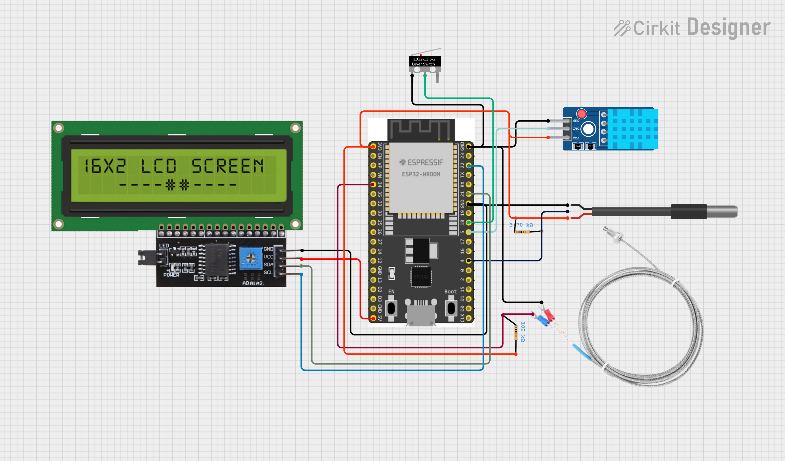

# Thermometer-for-Traveler
Sebuah perangkat praktis yang dirancang khusus bagi para penikmat alam bebas yang menggunakan esp32 sebagai microcontroller dengan fungsi dapat mengukur suhu tubuh, udara, makanan, dan kelembapan 

Proyek Sederhana ini disusun oleh kelompok 1 yang terdiri dari;
- Ammar Nabil Fauzan (2309106006)
- Muhammad Arya Fayyadh Razan (2309106010)
- Zhorif Fachdiat (2309106014)
- Muhammad Ghazali (2309106041)
---
### Pembagian Tugas

Agar proyek sederhana ini berjalan lancar, kami melakukan pembagian tugas berdasarkan keahlian masing-masing anggota
- Ammar bertugas untuk memastikan proyek sesuai dengan menguji fungsional sensor
- Arya meneliti beberapa penelitian terkait yang menjadi motivasi kami dalam memberikan solusi ini
- Zhorif merangkai alat dan merapikan kabel pada breadboard
- Ghazali mengoding agar sensor bisa membaca dengan benar
---
### Komponen

Komponen yang digunakan pada proyek ini diantaranya;
1. 1 Esp32-WROOM-32D
2. 1 Sensor NTC
3. 1 Sensor DS18B20
4. 1 Sensor DHT11
5. 1 LCD 16x2
6. 1 Button
7. 1 Power eksternal
---
### Board Schematics

  

